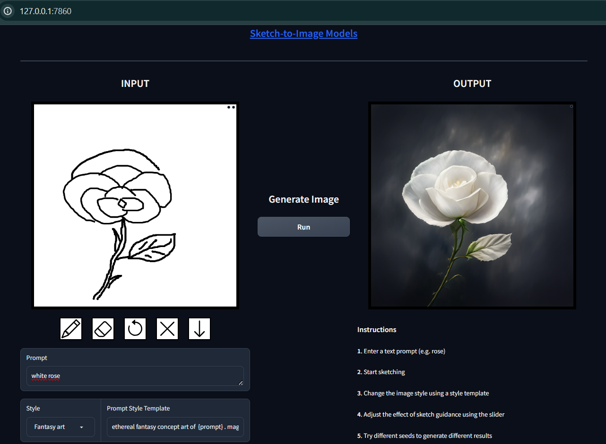
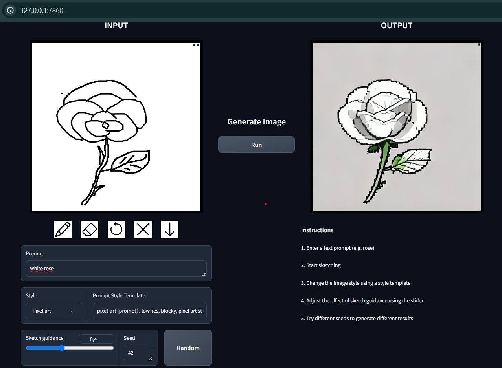
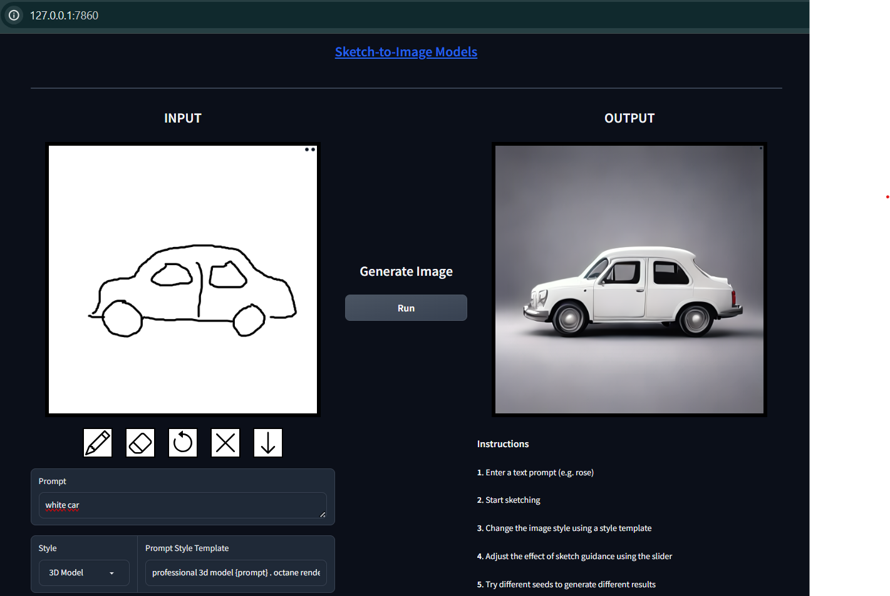

# Sketch-to-Image Model

This model allows you to generate images from sketch drawings. It is built on top of the open-source code from img2img-turbo: https://github.com/GaParmar/img2img-turbo

Features:

- Generate images from simple sketch drawings.
- Supports various image styles.
- Customize image resolution and quality.
- Easy to use with a simple interface.

Running the model:

1. Installation:
- Clone the code to your computer: 
    >git clone https://github.com/quan131/Sketch-to-Image-Model.git
- Install the required libraries: 
    >pip install -r requirements.tx

2. Download a model checkpoint file and put it in the "checkpoint" folder:
- sketch_to_image_stochastic:
    >https://www.cs.cmu.edu/~img2img-turbo/models/sketch_to_image_stochastic_lora.pkl

3. Run the model:

- Run the following command: python app.py
- Select your sketch drawing and the desired image style.
- Click the "Generate Image" button to start the process.

## Results:
- A white rose, with style "Fantasy art"

- A white rose, with style "Pixel art"

- A white car, with style "3D Model"

## References:

img2img-turbo: https://github.com/GaParmar/img2img-turbo